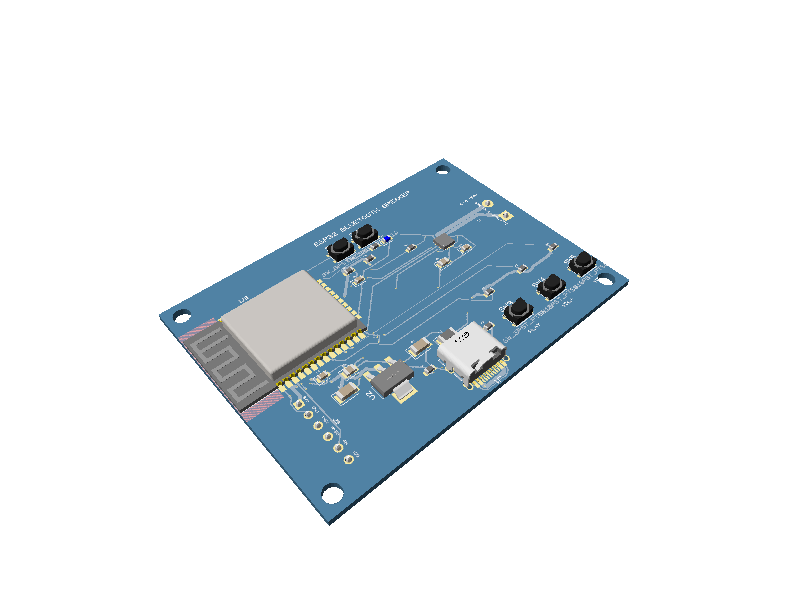

# ESP32 Bluetooth Speaker

A compact, USB-C-powered mono Bluetooth speaker PCB built with tscircuit. An ESP32-WROOM-32E receives Bluetooth Classic A2DP audio and sends I2S to a MAX98357A filterless class-D amplifier.



## What is included

- 70 mm × 50 mm, two-layer PCB with four 3.2 mm mounting holes
- ESP32-WROOM-32E-N8 with a full-height, all-layer antenna keepout
- MAX98357A I2S mono amplifier for a 4–8 Ω speaker
- USB-C 5 V power-only input, dual 5.1 kΩ CC sink resistors, and a 1.1 A resettable fuse
- AMS1117-3.3 supply, local bulk/bypass capacitors, and a bottom GND plane
- Reset and boot buttons plus a six-pin UART programming header
- Play/pause, volume-up, and volume-down buttons
- GPIO-controlled status LED
- Routed PCB, schematic, circuit JSON, 3D render, and regression snapshots

This design is powered only from USB-C; it does not include a battery, charger, microphone, USB data, or USB Power Delivery negotiation. Use a regulated 5 V USB-C supply rated for at least 1.5 A.

## Firmware pin map

| Function | ESP32 GPIO | Direction / behavior |
| --- | ---: | --- |
| I2S BCLK | 26 | Output |
| I2S LRCLK / WS | 25 | Output |
| I2S audio data | 22 | Output to MAX98357A DIN |
| Amplifier enable / mono mix | 23 | Drive high to enable; low shuts down |
| Play / pause | 32 | Active-low input |
| Volume up | 33 | Active-low input |
| Volume down | 27 | Active-low input |
| Status LED | 19 | Active-high output |
| UART TX | TXD0 | Programming header pin 3 |
| UART RX | RXD0 | Programming header pin 4 |

Use the ESP-IDF Bluetooth Classic A2DP sink API. Configure I2S for the pin map above and drive GPIO23 high after I2S is ready. The 634 kΩ series resistor selects the MAX98357A left/2 + right/2 mono mode at a 3.3 V logic-high level. GAIN is tied to GND for 12 dB gain.

## Connectors

The six-pin UART header is ordered: `3V3`, `GND`, `TXD0`, `RXD0`, `EN`, `IO0`.

The speaker output is bridge-tied. Connect the speaker only between `SPK_POS` and `SPK_NEG`; neither terminal may be connected to ground. Use a 4–8 Ω speaker rated for at least 3 W.

## Build and inspect

```sh
bun install
bun run typecheck
npx tsci check index.circuit.tsx
npx tsci build index.circuit.tsx --all-images
npx tsci snapshot index.circuit.tsx --update --3d
```

Generated artifacts are in `dist/index/`; checked snapshots are in `__snapshots__/`.

Published package: [seveibar/esp32-bluetooth-speaker](https://tscircuit.com/seveibar/esp32-bluetooth-speaker)

## Design files

- `index.circuit.tsx` — complete circuit, schematic placement, PCB placement, and routing
- `imports/` — exact JLCPCB footprints and 3D models for the ESP32, USB-C connector, and regulator
- `BOM.csv` — prototype bill of materials and sourcing notes
- `dist/index/circuit.json` — generated tscircuit circuit JSON
- `dist/index/pcb.svg` — routed PCB preview
- `dist/index/schematic.svg` — schematic preview
- `dist/index/3d.png` — 3D assembly preview

## Prototype notes

- The design passes TypeScript and tscircuit checks with zero errors. tscircuit still emits non-blocking metadata warnings for generated/imported components and unnamed traces; all intended nets are present and the PCB contains 66 routed trace trees.
- Verify the selected AMS1117 clone's output-capacitor ESR requirement. For a production revision, a small buck regulator is preferable for lower heat and better ESP32 peak-current margin.
- Keep the ESP32 antenna region clear of copper, batteries, the speaker magnet, enclosure metal, and wiring.
- Keep speaker leads short and route them away from the ESP32 antenna. Add ferrite filtering if enclosure/cable EMI testing requires it.
- Before fabrication, run the PCB vendor's DFM check and verify the USB-C, speaker connector, buttons, and enclosure against physical samples.
